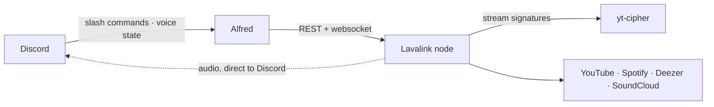

# Alfred


A Discord music bot. Someone runs `/play`, Alfred joins their voice channel and
queues what they asked for; `/queue` shows what is playing and carries the
buttons for changing it. The audio never touches this process — a Lavalink node
does the streaming, and the bot only tells it what to do.

A rewrite of the [`legacy-python` branch of bachtran02/MusicCat](https://github.com/bachtran02/MusicCat/tree/legacy-python)
on the current generation of those libraries.

## Language

One meaning each, in the code and on screen.

| Word | What it means | Avoid |
|---|---|---|
| **Player** | The guild's `AlfredPlayer`: its queue, loop and shuffle state. One per guild, created on the first join, destroyed by Lavalink. Holds nothing about Discord | session, connection |
| **Queue** | The tracks waiting. The playing track is **not** in it — `player.current` is separate, and Lavalink only sets it once the node confirms the track started | |
| **Panel** | The reply to `/queue`: an embed describing the player, with a row of buttons under it. The only thing the bot renders that can be pressed | now-playing message, controller, view |
| **Node** | A Lavalink server. It does the streaming; the bot holds no audio | server, backend |
| **Source** | A search backend behind a Lavalink prefix (`ytsearch`, `dzsearch`). Not every Source is **playable** — Spotify is mirrored onto another source by LavaSrc | provider |
| **Load result** | What a query resolved to: track, search, playlist, empty or error | |

**The bot posts nothing unprompted.** Every message it sends is the reply to a
command someone ran — no message per track, no announcements.

---

## Architecture



Three processes, and **the audio path skips the bot entirely** — the node sends
packets straight to Discord's voice servers. No database, no queue, no worker,
no cron: all state is in memory, deliberately. A restart drops the queues, which
is the behaviour the legacy bot had and has never been a complaint.

---

## Commands

Eight, and `/play` connects to your voice channel on its own — there is no
`/join`.

| Group | Commands | |
|---|---|---|
| **Music** | `/play` `/search` | add a track, playlist or URL to the queue |
| **Queue** | `/queue` `/skip` `/remove` | the panel, move past a track, drop something |
| **Voice** | `/leave` | disconnect and clear |
| **Owner** | `/stats` `/info` | node health, and what the node is running |

| | |
|---|---|
| Loop and shuffle are **options**, not commands | Set once as the tracks are queued, rather than adjusted mid-track. Loop is also a button |
| `/search` narrows by source and type | Track, artist, album or playlist, through the [LavaSearch](https://github.com/topi314/LavaSearch) plugin. Autocomplete queries the node as you type |
| `/queue` needs no voice check; its **buttons** do | Reading what is playing is not privileged. Acting on the player is, so only members in the bot's voice channel may press |
| There is no `/pause` | Deafening yourself pauses playback when you are the only listener, and undeafening resumes it. The panel's Pause button is the only manual path |
| The bot leaves once it is alone | Nobody left to hear it |

---

## The panel

`/queue` is the whole player interface: current track, progress, what is next,
and four buttons.

| Button | Does | Note |
|---|---|---|
| `Pause` / `Resume` | Toggles playback | The label follows the player, so the control reads the same to someone who has never used the bot |
| `Skip` | Plays the next track | Defers first: `play()` only *asks* the node, and `player.current` catches up when the node reports back |
| `Loop: off` / `track` / `queue` | Cycles the loop mode | State lives in the label, not in a swapped emoji |
| `Stop` | Clears the player | Then takes the buttons off the message |

Each press redraws that message — the panel never posts a second one. The
buttons go quiet after three minutes without a press, refreshed by every press,
and are then removed; the embed stays where it is, readable as the queue it was.

---

## YouTube needs a cipher server

The one piece of this that is not obvious, and the reason `docker compose` has a
third service.

YouTube protects its audio URLs with an obfuscated JavaScript player that has to
be *run* to turn a stream signature into something playable, and youtube-source's
own extractor can no longer read it. Every client fails with `Must find sig
function from script`, search keeps working, and nothing plays. Upstream's answer
on [youtube-source#225](https://github.com/lavalink-devs/youtube-source/issues/225)
is a remote cipher server rather than a release to wait for.

[yt-cipher](https://github.com/kikkia/yt-cipher) runs that script and answers
over HTTP. `docker compose up` starts one, `application.yml` points at it, and
`CIPHER_PASSWORD` in `.env` is what the two sides agree on.

| | |
|---|---|
| **Self-hosted by default** | The author runs a public instance at `cipher.kikkia.dev` — fine for a laptop, but it is shared, rate limited to 10 req/s, and sees every player script your node asks about |
| **A cipher server does not fix `sign in to confirm you're not a bot`** | That is YouTube objecting to your IP, not to the request. The fixes are a poToken or OAuth, both covered in `application.yml.example` — use exactly one |

---

## Running it

### With Docker

```sh
cp .env.example .env                                           # DISCORD_TOKEN, CIPHER_PASSWORD
cp lavalink/application.yml.example lavalink/application.yml   # then fill in plugin credentials
docker compose up -d
```

Three services: **yt-cipher**, the **node**, then the **bot**, each waiting on
the one before it. On Linux, `chown -R 322:322 lavalink/logs lavalink/plugins`
before the first run, or the node cannot write.

The image is a snapshot of the code, so a change needs
`docker compose up -d --build bot`. Develop against the node instead:

```sh
docker compose up -d lavalink   # just the node — 2333 is published to the host
uv run alfred                   # the bot on the host, LAVALINK_HOST=127.0.0.1
```

### Without Docker at all

Lavalink is a JVM service, so this needs a Java 17+ runtime:

```sh
winget install --id Microsoft.OpenJDK.21 -e   # once
.\scripts\lavalink.ps1                        # fetches Lavalink.jar, then runs the node
uv run alfred                                 # second terminal
```

Order matters — the bot connects to the node at startup. `LAVALINK_HOST=127.0.0.1`
is the only difference from the Docker setup, and it cannot break it:
`docker-compose.yml` sets `LAVALINK_HOST=lavalink` in `environment:`, which
overrides whatever `env_file` supplies.

### Before the first run

Three things about the node's config, all commented in
`application.yml.example`, and the **first two are fatal**:

| | |
|---|---|
| **A cipher server is required** | Without it every YouTube client fails and nothing plays. On the bare-JVM path, either `docker compose up yt-cipher` alongside, or point `remoteCipher.url` at the public instance |
| **Deezer is off, and stays off until configured** | LavaSrc refuses to start with `deezer: true` and an empty `masterDecryptionKey`, and the node exits before binding a port. Turn it on in the same edit that fills the credentials in |
| **Spotify degrades instead** | With no credentials it registers fine and fails per request, so `/search` on Spotify returns nothing until `clientId`/`clientSecret` are set. YouTube needs no credentials at all |

---

## Configuration

Everything is read from the environment; a `.env` file is loaded if present.

| Variable | Default | Meaning |
|---|---|---|
| `DISCORD_TOKEN` | *required* | The bot token |
| `LAVALINK_HOST` | `lavalink` | Node hostname. `127.0.0.1` when the bot runs on the host |
| `LAVALINK_PORT` | `2333` | Node port |
| `LAVALINK_PASSWORD` | `youshallnotpass` | Node password |
| `LAVALINK_REGION` | `eu` | Region the node is assigned to |
| `LAVALINK_SSL` | `false` | Use `wss`/`https` to reach the node |
| `LAVALINK_NODE_NAME` | `default-node` | What the node is called in logs and `/stats` |
| `LAVALINK_NODES` | unset | JSON array of node objects, for more than one node |
| `CIPHER_PASSWORD` | *required by compose* | Shared between the node and yt-cipher. Any random string |
| `DEFAULT_GUILDS` | unset | Guild IDs to register commands in. Global if unset |
| `DELETE_AFTER` | `60` | Seconds before command replies clean themselves up. `0` keeps them |
| `LOG_LEVEL` | `INFO` | Level for the bot's own loggers |
| `LOG_DIR` | unset | Write rotating `bot.log` and `track.log` here |

`LAVALINK_NODES` takes partial objects — anything left out falls back to the
single-node variables above:

```sh
LAVALINK_NODES='[{"name": "eu-1", "region": "eu"}, {"name": "us-1", "host": "10.0.0.4", "region": "us"}]'
```

Register to `DEFAULT_GUILDS` while developing: global commands take up to an
hour to propagate, guild commands are instant.

---

## Dependencies

`uv sync` creates `.venv` from `uv.lock`, on the Python named in
`.python-version`. The lock is committed and pins everything;
`pyproject.toml` carries floors only.

```sh
uv sync --frozen    # install the lock exactly — what the Docker build does
uv add <package>    # add a dependency and update the lock
uv lock --upgrade   # move the lock forward within the floors
```

Checks, both of which should be clean:

```sh
uv run pytest
uv run ruff check .
```

`--frozen` fails the build when the lock has drifted from `pyproject.toml`, so a
forgotten `uv lock` breaks the build rather than the deploy.

---

## Layout

```
alfred/
├── bot.py          entrypoint: hikari bot, lightbulb client, Lavalink client
├── config.py       the environment → a frozen Config
├── service.py      join · resolve · enqueue — the one seam
├── player.py       AlfredPlayer — the queue, and where its tracks came from
├── events.py       Lavalink events → the log
├── menus.py        the buttons under /queue
├── hooks.py        command checks
├── search.py       LavaSearch client
├── embeds.py       embed builders
└── extensions/     general · play · queue · admin
```

| Document | |
|---|---|
| [`docs/prd.md`](docs/prd.md) | What the bot is for, who operates it, and the requirements this release is measured against |
| [`docs/design.md`](docs/design.md) | How it is put together, and why the rewrite is shaped differently from the version it replaces |

---

## Notes on the rewrite

Every library underneath this changed shape since the legacy version.

| Change | What it meant |
|---|---|
| **lightbulb 2 → 3** | `BotApp`, plugins and the decorator stack are gone. Commands are classes, checks are execution hooks, and `bot.d` is replaced by dependency injection — the Lavalink client and config are registered on the DI registry and injected into commands |
| **hikari-miru is gone** | The buttons it existed for are now `lightbulb.components.Menu`, which ships with lightbulb itself — and they live under `/queue` rather than under a message posted for every track |
| **Lavalink.py 5.1 → 5.11** | `Client._dispatch_event` is synchronous, `AudioTrack.stream` is `is_stream`, nodes take a required region, and `Node.request` is public — so the LavaSearch call no longer reaches into `node._transport._request` |
| **No `delete_after`** | lightbulb dropped it, so self-deleting replies are scheduled in `responses.py` |
| **Loop constants are the library's** | The legacy player defined `LOOP_QUEUE = 1` and `LOOP_SINGLE = 2`, inverted against Lavalink's own — so its `/loop track` looped the queue. Unnoticed because a single-track queue makes the two indistinguishable |
| **Options, not `eval`** | Booleans replaced `choices=['True']` strings parsed with `eval` |
| **Configuration is the environment** | Rather than hardcoded in `config.py` |

---

Original project by [bachtran02](https://github.com/bachtran02/MusicCat), inspired by
[Ashema](https://github.com/nauqh/Ashema) in collaboration with [Nauqh](https://github.com/nauqh).
